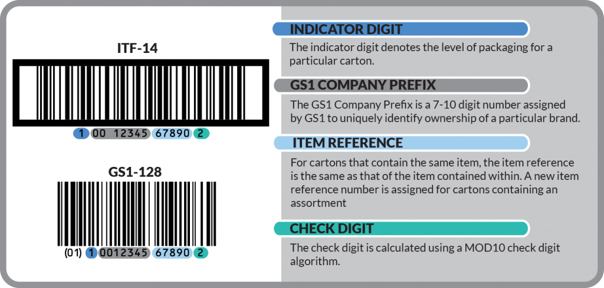

# gtin_toolkit for Dart


<div style="max-width: 50vw;">



</div>

A toolkit for validate GTIN's and generate GTIN as well.

This project indeeds to be, stable, easy to use and fast (when possible).

## Features

Actually this library could make something like :

- Validate

  GTIN including types, `SSCC`, `GSIN`, `GTIN-14`, `GTIN-13`, `GTIN-12`, `GTIN-8`.

- Generate Random valid GTIN

  Only need give the amount of GTIN digits ex.: for `SSCC` use `18` digits.

- Classify GTIN

  Return type using length for classify `SSCC`, `GSIN`, `GTIN-14`, `GTIN-13`, `GTIN-12`, `GTIN-8`.

## Use Example

```dart

import 'package:gtin_toolkit/gtin_toolkit.dart' as gtinTool;
import 'package:test/test.dart';

void main() {
  test('All methods are being exported correctly', () {
    String validGtin = '83636560160125';
    String invalidGtin = '83636560160122';
    List<int> validGtinArray = validGtin.split('').map(int.parse).toList();
    List<int> invalidGtinArray = invalidGtin.split('').map(int.parse).toList();

    expect(gtinTool.parseAndValidate(validGtin), true); // => true
    expect(gtinTool.parseAndValidate(invalidGtin), false); // => false

    expect(gtinTool.isValidGTIN(validGtinArray), true); // => true
    expect(gtinTool.isValidGTIN(invalidGtinArray), false); // => false

    expect(true, true);
  });
}


```
